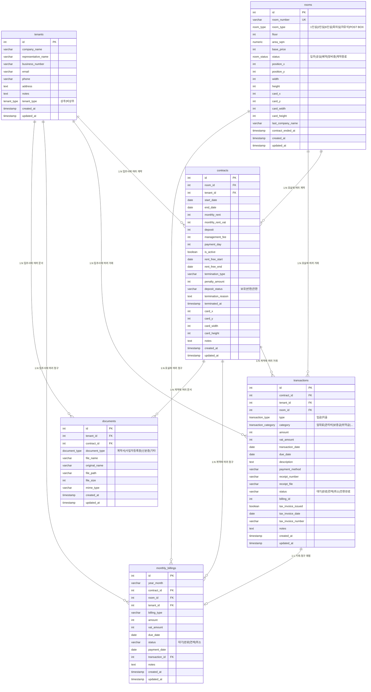

# Office Management DB ERD

> 최종 업데이트: 2026-02-16

## ERD 다이어그램

---

## 테이블 상세

### 1. rooms (호실)

| 컬럼 | 타입 | Nullable | 기본값 | 설명 |
|------|------|----------|--------|------|
| **id** | int (PK) | NO | auto_increment | 호실 고유 ID |
| **room_number** | varchar (UNIQUE) | NO | - | 호실 번호 |
| **room_type** | room_type (ENUM) | NO | - | 호실 유형 |
| **floor** | int | NO | 3 | 층수 |
| **area_sqm** | numeric | YES | - | 면적 (㎡) |
| **base_price** | int | NO | 0 | 기본 임대료 |
| **status** | room_status (ENUM) | NO | '공실' | 호실 상태 |
| position_x | int | YES | - | 평면도 X 좌표 |
| position_y | int | YES | - | 평면도 Y 좌표 |
| width | int | YES | - | 평면도 너비 |
| height | int | YES | - | 평면도 높이 |
| card_x | int | YES | - | 카드 X 좌표 |
| card_y | int | YES | - | 카드 Y 좌표 |
| card_width | int | YES | 180 | 카드 너비 |
| card_height | int | YES | 100 | 카드 높이 |
| last_company_name | varchar | YES | - | 마지막 입주사명 |
| contract_ended_at | timestamp | YES | - | 계약 종료 시점 |
| created_at | timestamp | YES | CURRENT_TIMESTAMP | 생성일 |
| updated_at | timestamp | YES | CURRENT_TIMESTAMP | 수정일 |

### 2. tenants (입주사)

| 컬럼 | 타입 | Nullable | 기본값 | 설명 |
|------|------|----------|--------|------|
| **id** | int (PK) | NO | auto_increment | 입주사 고유 ID |
| **company_name** | varchar | NO | - | 회사명 |
| **representative_name** | varchar | NO | - | 대표자명 |
| business_number | varchar | YES | - | 사업자등록번호 |
| email | varchar | YES | - | 이메일 |
| phone | varchar | YES | - | 전화번호 |
| address | text | YES | - | 주소 |
| notes | text | YES | - | 비고 |
| **tenant_type** | tenant_type (ENUM) | NO | '상주' | 입주 유형 |
| created_at | timestamp | YES | CURRENT_TIMESTAMP | 생성일 |
| updated_at | timestamp | YES | CURRENT_TIMESTAMP | 수정일 |

### 3. contracts (계약)

| 컬럼 | 타입 | Nullable | 기본값 | 설명 |
|------|------|----------|--------|------|
| **id** | int (PK) | NO | auto_increment | 계약 고유 ID |
| **room_id** | int (FK → rooms) | NO | - | 호실 ID |
| **tenant_id** | int (FK → tenants) | NO | - | 입주사 ID |
| **start_date** | date | NO | - | 계약 시작일 |
| **end_date** | date | NO | - | 계약 종료일 |
| **monthly_rent** | int | NO | - | 월 임대료 (VAT 제외) |
| **monthly_rent_vat** | int | NO | 0 | 월 임대료 VAT |
| **deposit** | int | NO | 0 | 보증금 |
| **management_fee** | int | NO | 0 | 관리비 |
| payment_day | int | YES | 10 | 납부일 |
| is_active | boolean | YES | true | 계약 활성 여부 |
| rent_free_start | date | YES | - | 렌트프리 시작일 |
| rent_free_end | date | YES | - | 렌트프리 종료일 |
| termination_type | varchar | YES | - | 해지 유형 |
| penalty_amount | int | YES | 0 | 위약금 |
| deposit_status | varchar | YES | '보유' | 보증금 상태 |
| termination_reason | text | YES | - | 해지 사유 |
| terminated_at | timestamp | YES | - | 해지일시 |
| card_x / card_y | int | YES | - | 카드 좌표 |
| card_width / card_height | int | YES | 200 / 120 | 카드 크기 |
| notes | text | YES | - | 비고 |
| created_at | timestamp | YES | CURRENT_TIMESTAMP | 생성일 |
| updated_at | timestamp | YES | CURRENT_TIMESTAMP | 수정일 |

### 4. transactions (거래 내역)

| 컬럼 | 타입 | Nullable | 기본값 | 설명 |
|------|------|----------|--------|------|
| **id** | int (PK) | NO | auto_increment | 거래 고유 ID |
| contract_id | int (FK → contracts) | YES | - | 계약 ID |
| tenant_id | int (FK → tenants) | YES | - | 입주사 ID |
| room_id | int (FK → rooms) | YES | - | 호실 ID |
| **type** | transaction_type (ENUM) | NO | - | 거래 유형 (입금/지출) |
| **category** | transaction_category (ENUM) | NO | - | 거래 카테고리 |
| **amount** | int | NO | - | 금액 |
| vat_amount | int | YES | 0 | VAT 금액 |
| **transaction_date** | date | NO | - | 거래일 |
| due_date | date | YES | - | 납부 기한 |
| description | text | YES | - | 설명 |
| payment_method | varchar | YES | - | 결제 방법 |
| receipt_number | varchar | YES | - | 영수증 번호 |
| receipt_file | varchar | YES | - | 영수증 파일 |
| status | varchar | YES | '완료' | 거래 상태 |
| billing_id | int | YES | - | 청구 ID |
| tax_invoice_issued | boolean | YES | false | 세금계산서 발행 여부 |
| tax_invoice_date | date | YES | - | 세금계산서 발행일 |
| tax_invoice_number | varchar | YES | - | 세금계산서 번호 |
| notes | text | YES | - | 비고 |
| created_at | timestamp | YES | CURRENT_TIMESTAMP | 생성일 |
| updated_at | timestamp | YES | CURRENT_TIMESTAMP | 수정일 |

### 5. monthly_billings (월별 청구)

| 컬럼 | 타입 | Nullable | 기본값 | 설명 |
|------|------|----------|--------|------|
| **id** | int (PK) | NO | auto_increment | 청구 고유 ID |
| **year_month** | varchar | NO | - | 청구 년월 (YYYY-MM) |
| contract_id | int (FK → contracts) | YES | - | 계약 ID |
| room_id | int (FK → rooms) | YES | - | 호실 ID |
| tenant_id | int (FK → tenants) | YES | - | 입주사 ID |
| **billing_type** | varchar | NO | - | 청구 유형 |
| **amount** | int | NO | - | 청구 금액 |
| vat_amount | int | YES | 0 | VAT 금액 |
| **due_date** | date | NO | - | 납부 기한 |
| status | varchar | YES | '대기' | 청구 상태 |
| payment_date | date | YES | - | 납부일 |
| transaction_id | int (FK → transactions) | YES | - | 연결된 거래 ID |
| notes | text | YES | - | 비고 |
| created_at | timestamp | YES | CURRENT_TIMESTAMP | 생성일 |
| updated_at | timestamp | YES | CURRENT_TIMESTAMP | 수정일 |

### 6. documents (문서)

| 컬럼 | 타입 | Nullable | 기본값 | 설명 |
|------|------|----------|--------|------|
| **id** | int (PK) | NO | auto_increment | 문서 고유 ID |
| tenant_id | int (FK → tenants) | YES | - | 입주사 ID |
| contract_id | int (FK → contracts) | YES | - | 계약 ID |
| **document_type** | document_type (ENUM) | NO | - | 문서 유형 |
| **file_name** | varchar | NO | - | 저장 파일명 |
| **original_name** | varchar | NO | - | 원본 파일명 |
| **file_path** | varchar | NO | - | 파일 경로 |
| file_size | int | YES | - | 파일 크기 (bytes) |
| mime_type | varchar | YES | - | MIME 타입 |
| created_at | timestamp | YES | CURRENT_TIMESTAMP | 생성일 |
| updated_at | timestamp | YES | CURRENT_TIMESTAMP | 수정일 |

---

## ENUM 타입 정의

### room_type (호실 유형)
| 값 | 설명 |
|----|------|
| 1인실 | 1인 사무실 |
| 2인실 | 2인 사무실 |
| 6인실 | 6인 사무실 |
| 회의실 | 회의실 |
| 자유석 | 자유석 (코워킹) |
| POST BOX | 비상주 우편함 |

### room_status (호실 상태)
| 값 | 설명 |
|----|------|
| 입주 | 현재 입주 중 |
| 공실 | 비어있음 |
| 예약 | 입주 예약 |
| 정비중 | 정비/수리 중 |
| 계약종료 | 계약 종료됨 |

### tenant_type (입주사 유형)
| 값 | 설명 |
|----|------|
| 상주 | 상주 입주사 |
| 비상주 | 비상주 (우편/등록만) |

### transaction_type (거래 유형)
| 값 | 설명 |
|----|------|
| 입금 | 수입 |
| 지출 | 지출 |

### transaction_category (거래 카테고리)
| 값 | 구분 | 설명 |
|----|------|------|
| 임대료 | 입금 | 월 임대료 |
| 관리비 | 입금 | 관리비 |
| 보증금 | 입금 | 보증금 수입 |
| 보증금입금 | 입금 | 보증금 입금 확인 |
| 사용료전환 | 입금 | 보증금→사용료 전환 |
| 위약금 | 입금 | 위약금 수입 |
| 비상주사용료 | 입금 | 비상주 사용료 |
| 회의실사용료 | 입금 | 회의실 사용료 |
| 1day사용료 | 입금 | 1일 사용료 |
| 월사용료 | 입금 | 월 사용료 |
| 기타수입 | 입금 | 기타 수입 |
| 유지보수 | 지출 | 유지보수비 |
| 공과금 | 지출 | 공과금 |
| 인건비 | 지출 | 인건비 |
| 마케팅 | 지출 | 마케팅비 |
| 청소미화 | 지출 | 청소/미화비 |
| 소모품 | 지출 | 소모품비 |
| 기타지출 | 지출 | 기타 지출 |

### document_type (문서 유형)
| 값 | 설명 |
|----|------|
| 계약서 | 임대차 계약서 |
| 사업자등록증 | 사업자등록증 |
| 신분증 | 신분증 |
| 기타 | 기타 문서 |

---

## 주요 관계 (FK)

| 관계 | 설명 |
|------|------|
| rooms → contracts | 하나의 호실에 여러 계약 (시간순) |
| tenants → contracts | 하나의 입주사에 여러 계약 |
| contracts → transactions | 하나의 계약에 여러 거래 발생 |
| contracts → monthly_billings | 하나의 계약에 매월 청구 생성 |
| transactions ↔ monthly_billings | 청구와 거래 1:1 매핑 (입금 확인 시) |
| tenants → documents | 입주사별 문서 첨부 |
| contracts → documents | 계약별 문서 첨부 |
